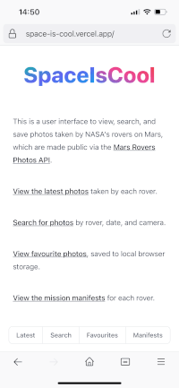
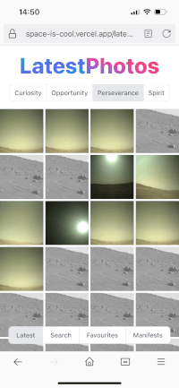
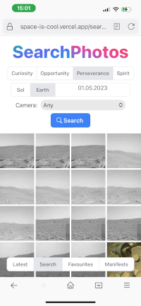
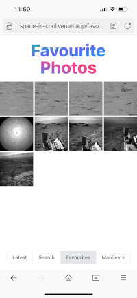

## About The Project

This is a user interface to view, search, and save photos taken by
NASA&apos;s rovers on Mars, which are made public via the [Mars Rovers Photos API](https://api.nasa.gov/#mars-rover-photos), made with Next.js 13, React Server Components, Tailwind CSS, and TypeScript.

[View demo](https://space-is-cool.vercel.app/).

## Screenshots from mobile device

  

  


## Run it locally

### Prerequisites

- Get a [NASA developer key](https://api.nasa.gov/#signUp).

### Installation

1. Clone the repo
   ```sh
   git clone https://github.com/james-langridge/space-is-cool.git
   ```

2. Install NPM packages
   ```sh
   npm install
   ```

3. Copy `.env.local.example` to `.env.local` and add your API key.
    ```sh
    cp .env.local.example .env.local
    ```

6. Start the development server:
    ```sh
    npm run dev
    ```

## Deploy your own

You can clone and deploy this project on Vercel using the button below.

[](https://vercel.com/new/clone?repository-url=https%3A%2F%2Fgithub.com%2Fjames-langridge%2Fspace-is-cool&env=NEXT_PUBLIC_API_KEY,NEXT_PUBLIC_BASE_URL&envDescription=API%20keys%20needed%20for%20the%20application.&envLink=https%3A%2F%2Fgithub.com%2Fjames-langridge%2Fspace-is-cool%23readme)

See the [Next.js deployment documentation](https://nextjs.org/docs/deployment) for more details.

## License

Code distributed under the [MIT License](https://github.com/james-langridge/space-is-cool/blob/main/LICENSE).
